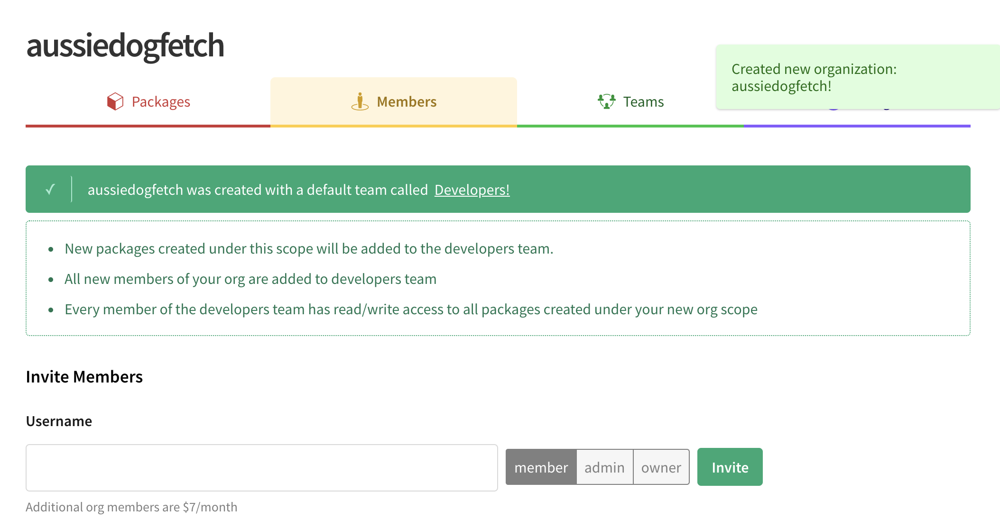
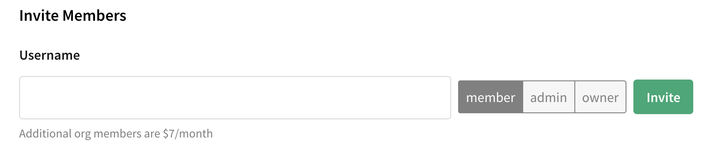

<!--
title: QA-ORGS-2 - Getting Started
featured: true
-->

# Getting Started

To easily collaborate with other developers, use npm Organizations. This page will teach you how to create an account using npm, then navigate npm's web interface to create an Organization.

First, [create a new npm account](https://docs.npmjs.com/getting-started/installing-node). 

You might want to [develop your profile settings](https://docs.npmjs.com/getting-started/modifying_your_profile_from_command_line) as well but you can create your org first if you prefer. 

## 1. Create an Org

Choose `Create an Organization` from your avatar menu. Or, you can just click [the create website].

Enter a name for your organization, then choose a plan:

### Naming your Organization
Please take your time to choose this name. Choose wisely, as changing your Organization name is complicated and requires [contacting npm Support]. 
[Learn more about renaming and/or deleting your Organization].

#### Converting a username to an Org name

If you like your username, and wish you could use that for an Org name, there is a way to do this. If you convert your username to an organization name:

* You will be able to pick a new username.

* You will still have the same rights to packages that you did before.

* We recommend you choose a version of the original username so that collaborators will recognize you. For example, if you converted your username _aussiedogfetch_ to an Org name, you might name your new username _aussiedogfetch-user_. 

If you want to take this step, click the note reading "Want to convert _yourusername_ to an Organization" to get started. 

### Choosing a Plan 

Once you've named your Organization, you'll need to choose a plan.
Currently, npm offers 2 plans:

  - **Free**: public packages only.
  - **Paid**: install and publish **private packages** ($7/user/month).

For example, if you have 3 users, an Organization that only needs public 
packages will be entirely free. However, if your Organization needs to
install and publish **private packages**, it will cost $21/month 
($7/month*3 users).

**You can change your plan any time through the billing panel.** 

For more information on the features of each plan, visit our [pricing page].

Once you have chosen your plan, click the green "Create an Org"
button.

## 2a. Enter Payment Information (paid Orgs only)

If you chose an Organization with access to private packages, clicking the
green "Create an Org" button will bring up a Stripe Payments
prompt. 

After you enter a name and address, you'll see a credit card entry screen. Please enter the appropriate credit card information, note the total shown in the blue button, and press Pay to continue.

Your credit card will be immediately billed $7 for a single user, the
account of the person creating the Organization.

## 3. Explore your new Org page

After you press the green "Create an Org button" if it's an unpaid Org, or after you press the blue Pay button, if it's a paid Org, you will see the new page for your org:

You can now add new members. 

## 4. Add Members to your Organization 

Now that you've created your Organization, you can immediately begin adding members. You can add members to your Organization at any time, so feel free to skip this step if you aren't ready to add users yet. These steps are explained in more detail later in this documentation.  

The user who created the Organization is:

- Automatically assigned the **role** of **Owner**. 
  [Learn more about Roles and Privileges].
- Automatically added to a **team** called **Developers**. 
  [Learn more about the Developers team].

To add users to your Organization: 

1. Enter their npm username into the text box.
2. Click the member, admin, or owner box.
3. Click the green Invite button.
4. The new member will appear in the Members list. 

If you chose an Organization with private package access, every user will add an additional $7/month to your bill.

**When you add a member to your Organization they are immediately added. They do not receive an email, so please let your new members know that you have added them.**

All the users you add from this interface are:

- Automatically assigned the **role** of **Member**
  [Learn more about Roles and Privileges].
- Automatically added to a **team** called **Developers**
  [Learn more about the Developers Team].

If the person you would like to add to your Organization does not have an
npm username, they'll need to create an npm user account. You can send them [this link][1] to sign up.

## 5. More about Billing Information (paid Orgs only)

Choose Billing Info from your Avatar menu to set billing information. For example, you might want billing emails to go to a different email than the one associated with your username. (This email does *not* have to match the owner's email). Your first bill date will be one month from the date you set up your Org. 

**You can change your billing info at anytime through your Organization's
billing page.**

[the create website]: https://www.npmjs.com/org/create
[npm website]: https://www.npmjs.com
[pricing page]: https://www.npmjs.com/pricing
[contacting npm Support]: https://www.npmjs.com//support
[Learn more about Roles and Privileges]: /roles-and-privileges.md
[Learn more about the Developers Team]: /the-developers-team.md
[Learn more about migrating a user account]: /migrating-a-user-account.md
[Learn more about renaming and/or deleting your Organization]: renaming-and-or-deleting-an-org.md 
[1]: https://www.npmjs.com/signup

# 