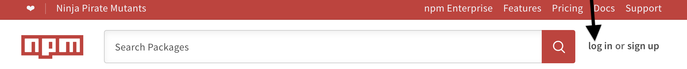
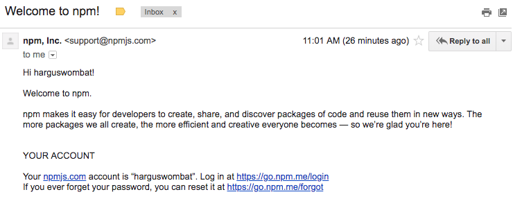

<!--
title: 03 - How to set up a new npm account & install npm-->

#Getting Started 

1. Creat an account from [npmjs.com](http://www.npmjs.com).

2. Install npm from a terminal console.

3. Login to the terminal with your new username. 

Note: Many of the steps that you can take from the browser can also be taken directly from the Command Line Interface. Skip [here](#Related-CLI-Commands) to learn more. 

## Create an Account

1. Go to http://www.npmjs.com and click 'log in'.

<!---->

2. Complete the sign up page.  

**Full Name** First and Last Name. (You can enter middle name(s) as well).

**Public Email** Enter an email account. This email address will be added to the metadata when you publish a package. This means that the email address can be discovered by anyone who downloads your packages. In addition, npm will send email to this acccount when you update packages, as well as occassional product updates and information.   

**Username** Enter the username that will be shown when you publish packages or interact with other users within npm. Choose a name that doesn't violate our policy guidelines. The name must be lower case. It can have dashes and numerals, but there are restrictions in order to prevent fake accounts. 

**Password** Follow the password guidelines on the screen.

3. Click the two boxes according to your wishes. Then click `Create an Account'. 

4. Open the email address that you entered.  

5. Find a message with the title  _Welcome to npm_ (search _All Mail_ in case the email doesn't appear in the inbox).

<!--

-->

The welcome message has links to helpful resources; you might want to flag it for later reference. 

_Note: If you can't find the welcome message, please click to resend:_  

<!--

-->

 
5. Click the link in your email. Success!  You will be sent to your new landing page. Notice the URL:

`https://www.npmjs.com/~yourusername`

This is a quick way to get to your page in the future.

 

### After you set up your Login Account

You now have a login account. Here are a few things you can do before (or after) you install npm:

* [Create/Edit your Profile](https://docs.npmjs.com/getting-started/modifying_your_profile_from_command_line)
* [Set up Two-Factor Authentication](https://docs.npmjs.com/getting-started/using-two-factor-authentication)
* [Create an Organization, Add Members, and Form Teams](https://www.npmjs.com/docs/orgs/)
* [Learn about Paid Accounts and Billing](https://www.npmjs.com/docs/orgs/managing-package-access.html)

Or you can install npm in the terminal console, as explained below, then come back to these steps. 

The following screen shot shows where the menu is if you want to explore the website, set up your profile, and get started right away:

 

## Terminals, Editors, and Git (For Beginners)

_Skip this section if you've worked with terminals or editors in the past._

At npm, we are thrilled to welcome many brand new coders to the javascript world. Before you begin using npm, you need to know about setting up a terminal, an editor, and git. Welcome!

First: 

1) Find the terminal emulator for your computer:

	* Help with Apple's [Terminal](https://support.apple.com/guide/terminal/welcome/mac).

	* Help with Microsoft Windows [PowerShell](https://docs.microsoft.com/en-us/powershell).
 
	* Linux [terminal emulators](https://opensource.com/life/17/10/top-terminal-emulators). 

2) Find and pick a text editor that you like. 

3) Consider signing up for a [git account](https://help.github.com/articles/set-up-git) account if you haven't already. 

There are additional resources for beginners and for everyone at the end of this chapter in the "Learn More" section.

## Install npm & Manage npm Versions

npm is written in Node.js, so you need to install Node.js in order to use npm. You can install npm via the Node.js website, or by installing a _Node Version Manager_ or NVM. This chapter explains both options. 

If you just want to get started exploring npm, using the Node.js installation method is fastest. If you are an advanced developer ready to jump in and work with versions, use the node version manager. If you aren't sure, please read this chapter before you decide. You can always change how you run npm in the future. 

### Installing npm from the Node.js site

#### 1. Install Node.js & npm

##### OS/X or Windows

If you're using OS X or Windows, use one of the installers from the [Node.js download page](https://nodejs.org/en/download/). Be sure to install the version labeled **LTS**. Other versions have not yet been tested with npm. 

	
##### Linux

If you're using Linux, choose one of these options:
* click [here](https://nodejs.org/en/download/package-manager/) to install npm for Linux in the way many Linux developers prefer.
* scroll through the installers on the [Node.js download page](https://nodejs.org/en/download/)
* check [NodeSource's binary distributions](https://github.com/nodesource/distributions) to see if there's a more recent version that works with your system. 

##### Less-Common Operating Systems

Click [here](https://nodejs.org/en/download/package-manager/) to learn about installing node.js for a variety of operating systems. 

#### 2. Test your Installation 
	
After installing, run `node -v`. The version should be v8.9.1 or higher.

#### 3. Update npm

When you install node.js, npm is automatically installed. However, npm gets updated more frequently than Node.js, so be sure that you have the latest version.

To test,  run `npm -v`. 

To be sure that this matches the latest version, scroll to the bottom of this page.  If the version you see does not match the latest version, run:

`npm install npm@latest -g`.

This will install the latest official, tested version of npm. 

### Using a Version Manager to install Node.js and npm

Since npm and node.js products are managed by different entities, updates and maintenance can become complex. Also, the Node.js installation process installs npm in a directory that only has local permissions. This can cause permissions errors when you attempt to run packages globally. 

To solve both these issues, many developers opt to use a *node version manager*, or *nvm*, to install npm. The version manager will avoid permissions errors, and will solve the complexities of updating Node.js and npm. 

In addition, developers can use an nvm to test their applications on multiple versions of npm. The nvm enables you to easily switch npm as well as node versions. This makes it easier to ensure that your applications work for most users, even if they are using other versions of npm. If you decide to install a version manager, use the instructions for the version manager you select to learn how to switch versions, and to learn how to keep up-to-date with the latest version of npm. 

#### Apple macOS 

Click [here](https://github.com/creationix/nvm/blob/master/README.md#installation) to learn how to install nvm for MacOs.  

#### Microsoft Windows 
 
To install and manage npm and Node.js on Windows, we suggest [nvm-windows](https://github.com/coreybutler/nvm-windows).

#### Linux 

Click [here] (https://github.com/creationix/nvm/blob/master/README.md#installation) to learn how to install nvm for Linux.

## Login to npm from a terminal 

To test your new account, type:

`npm login`

You will be promted for your username, password, and email. Be sure to spell your username exactly the same way as you entered it on the website, or you will create a new account. 

If you have already set up two-factor authentication, you will be asked for a one-time password when you login. Please see [the chapter about two-factor authentication](https://docs.npmjs.com/getting-started/using-two-factor-authentication) if you need more information.

To test that you have successfully logged in, type `npm whoami`.

## Experimenting with the Next Release 

*For more advanced users*

If you want to try the next, unreleased version of npm to test that packages you have created will work with the planned next release of npm, use this command:

`npm install npm@next -g`

This may simply reinstall the current version, depending on the development cycle. Also, this early version is not final. So features may or may not match what is ultimately released.   

## Learn More

To learn more about how to use node version manager, nvm, click [here](https://github.com/creationix/nvm/blob/master/README.md#usage).

For tutorials, a chance to meet others, and step-by-steps, explore **node school** and its helpful [site](https://nodeschool.io/) 

See npm's Laurie Voss on ["Stuff Everybody Knows Except You"](https://www.youtube.com/watch?v=JIJZnF_L5KI) if you are feeling overwhelmed in your dev learning. It will make you realize you are not alone! 

How to use Apple's terminal [Terminal](https://support.apple.com/guide/terminal/welcome/mac).
  
How to use Microsoft Windows [PowerShell](https://docs.microsoft.com/en-us/powershell).
 
How to find a Linux [terminal emulators](https://opensource.com/life/17/10/top-terminal-emulators). 

_Note: While relevant CLI commands are covered throughout this user documentation, the CLI includes command line help, its own [documentation section, and instant help (man pages)](https://docs.npmjs.com/cli/help)._