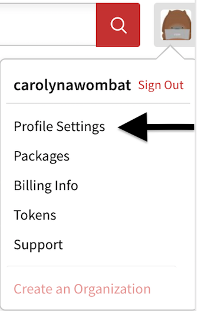

<!--
title: 16 - How to use two-factor authentication
featured: true
-->
# How to Use Two-Factor Authentication

*Requires npm version 5.5.1 or greater*

###_Are you who you say you are? Let's double-check._

To meet the increasing need for strong digital security, npm introduced two-factor authentication (2FA) or (tfa) with version 5.5.1. Two-factor authentication prevents unauthorized access to your account by confirming your identity using two methods:

* something you know (such as your username and password) 
* something you have (such as a phone or tablet)

For example, if your bank uses 2FA, the first time you logged in to your online banking system, the bank sent a code to your cell phone number, then prompted you to enter the code online. This proved that the cell phone was in your possession, and linked it to your account for authentication. After that, whenever the bank detects anything unusual, such as a login from a different laptop, it will send a temporary code to your phone that you must enter before you can login. This provides an extra layer of security because, even if someone obtains your login credentials, they are unlikely to have your device in their possession as well. Even if someone finds your phone, they are unlikely to also be able to hack your laptop's password. 

Two-factor authentication multiplies the protection against attacks, and we recommend that you implement this with your npm account.  

## Preparation

To enable 2FA with your npm account, you will need an application that can generate a One Time Password, or OTP. For example, [Authy](https://authy.com/download/) or 
[Google Authenticator](https://support.google.com/accounts/answer/1066447), can generate one time passwords (OTP's).  These products use a Time-Based One-Time Password Algorithm (TOTP) to create temporary codes.  Install the application on a mobile device or a second laptop that will always be available when you work in your npm account. (Note: npm does not use SMS (text-to-phone) as a method for authenticating users.)

## Levels of Authentication 
  
There are two levels of authentication, ***auth-only*** and ***auth-and-writes***.

If you enable 2FA in **auth-only** mode, npm will require an OTP when you:

* log in
* remove 2FA

If you enable 2FA in **auth-and-writes** mode, which is the default, npm will require an OTP when you:

* log in
* change your profile
* create or revoke tokens 
* publish packages 
* change access
* change your password
* make other sensitive changes to packages
* remove 2FA

Also, see the table at the end of this chapter. 


## How Do I Enable 2FA? 

To set up two-factor authentication, you can use either use: 
* the profile setting from  [the web site](https://www.npmjs.com).
* the command line interface (CLI).

Both approaches are explained in this chapter. Choose the method you like best. 

## Enabling 2FA from the web 

Two-factor authentication is now available as a profile setting from the website.    

1. Login to npmjs.com.
2. Click your avatar to see the options menu. 


1. Click Profile Settings. 


<!---->

2. Scroll down to the Security section:


3. Enter your password on the next page:


4. On the next screen, choose the level of 2FA you want. 


_Note: If you aren't sure which setting you want, see the table at the end of this chapter._

5. Click the plus sign to enable the level you want. (You can change the level later if you wish.) 

A QR code will appear (in the screen shot, the code is masked for security reasons). 


6. Follow the instructions on the screen to scan the QR code, then enter it. 

npm will display recovery codes. The recovery codes are what you will use to log in if you ever lose or forget your second factor device (for example, if you don't have your phone). 


7. **Print, screen capture and save these recovery codes in a place that is not near your second factor device. Your password manager may provide a way to save these safely.**

8. After you have saved the recovery codes, press `Go Back` to return to your profile.
 
Success! You will see your Profile page, with a message confirming that you set up tfa, plus an indicator in the Security section of the page.


## Enabling 2FA from the Command Line

Type the command that meets the level of security you wish to apply (auth-and-writes is the default).
  
        npm profile enable-2fa
        npm profile enable-2fa auth-and-writes 
        npm profile enable-2fa auth-only
      
npm will return this message:
            
       > npm notice profile Enabling two factor authentication for auth-and-writes   
       
   or this message: 
        
      > npm notice profile Enabling two factor authentication for auth-only
      
  depending on the setting you provided.    
      
Next, npm will display a QR code:


1. Add a new account to your authenticator app. 
2. Scan the QR code, or enter the number displayed just below the QR code. 

This will configure the authenticator app for future use, linking authentication to the device that generated the authentication. 

Using your authenticator app, enter an OTP at the prompt shown:

````
    Add an OTP code from your authenticator:
````

After you have entered the one-time password,  npm will display this message:

    2FA successfully enabled. 
    Below are your recovery codes, please print these out. 
    You will need these to recover access to your account 
    if you lose your authentication device.
 
After you have applied two-factor authentication, you can use the `npm profile get` command to confirm that it has been set.
 

 
 
### Example: Setting Profile Values from the CLI after Enabling 2FA

Once you have installed 2FA, you will need to enter an OTP for security-relevant commands. For example, whenever you use the command `npm profile set` you will need to enter an OTP before you can set or change a value, such as your fullname: 

```
$npm profile set fullname Carolyn A. Wombat
Enter OTP: 567452
Set fullname to Carolyn A. Wombat
```
 
 Use `npm profile get' to confirm the new setting. 
 

   
 *Note to our readers: We have reset the account used in screen shots; neither the QR nor the codes are still active. But thank you to those alert and kind wombats who have asked us about this.*
 
## How to add an OTP to a command

To add the OTP to a command, append it as shown:

``
npm owner add <user > --otp=123456
``

## Recovery Codes 

After you set up two-factor authentication, a series of recovery codes will appear on your screen. Please print them and save them as described. Note: Some authenticator applications and password management applications provide a method for you to store recovery codes.

### *Tip: Save recovery codes in a different location than the device you use to authenticate. For example, if you get your OTP from a tablet, don't save the codes in a case with your tablet.* 
         
The recovery procedure is explained below.    
   
### How to Remove Two-Factor Authentication from your Profile

To remove 2FA from your profile, type this command:

```
    npm profile disable-2fa
```
   
npm will prompt for your password:

````
    > npm password:   
````
Enter your npm password as prompted, then npm will display: 

```
   >Enter one-time password from your authenticator: 123456
``` 
 npm will confirm: 

```
   Two factor authentication disabled.   
```

### How to Send an OTP Value from the Command Line 

If you have enabled 2FA auth-and-writes, you will need to send the OTP from the command line for certain commands to work. To do this, append  `--otp=123456` (where *123456* is the code generated by your authenticator) at the end of the command. Here are a few examples: 

```
npm publish [<tarball>|<folder>][--tag <tag>] --otp=123456
npm owner add <user > --otp=123456
npm owner rm <user> --otp=123456
npm dist-tags add <pkg>@<version> [<tag>] --otp=123456
npm access edit [<package>) --otp=123456
npm unpublish [<@scope>/]<pkg>[@<version>] --otp=123456

```

## What to Do if You Misplace Your Second Device

If you cannot locate the device that provided second-factor authentication:

1. Find the recovery codes you saved when you enabled 2FA.
2. If you are logged out, login normally using your login and npm password. When prompted for an OTP, enter a recovery code. (Note that this might create a second authenticator account with the same npm account name. Be sure to use the newly created account.) 
3. Once you are logged in, type `npm profile disable-2fa` and enter your npm password if prompted.  
4. Enter an unused recovery code when you see this prompt:
  ```
   >Enter one-time password from your authenticator: 
``` 
5. npm will confirm that two-factor authentication has been disabled.
6. type `npm profile enable-2fa` to re-enable 2FA, assign a different device to your account, and generate new recovery codes. 

If you have misplaced your recovery codes, please contact npm customer support. 

###What if You See an Error after Entering the OTP?

If you are entering what seems to be a valid OTP but you see an error, be sure that you are using the correct authenticator account. In the screen shot below, the current account in Authy was set incorrectly because the developer had multiple npm test accounts. This will cause the OTP to fail. Also, as stated earlier, when you reset 2fa after it has been disabled, the authenticator might create a second account with the same name. Please see the authenticator documentation to delete the old account. 


## When Will npm Require the Second Factor?

If you enable 2-factor authorization, you will need to enter the second factor at various points as you use npm. This table explains these details. 


### Note

Settings you define using the Command Line Interface (CLI) will also apply to the website. 