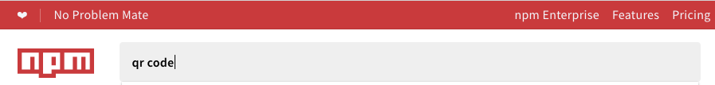

<!--
title: 01 - What is npm?
featured: true
-->
# What is npm?

npm opens up an entire world of JavaScript talent to you and to your team. It's the world's largest software registry, with approximately 3 billion downloads per week.The registry contains over 600,000 _packages_ (building blocks of code).  Open-source developers from every continent use npm to share and borrow packages. Packages are structured to enable you to keep track of dependencies and versions. 

Here is a quick introduction to npm:

<iframe width="670" height="480" src="https://www.youtube.com/embed/x03fjb2VlGY" frameborder="0" allowfullscreen></iframe>

npm consists of three distinct components:

*  the website
*  the registry
*  the Command Line Interface (CLI)

The [*website*](https://npmjs.com) is the primary way to discover packages, set up profiles, and manage other aspects of your npm experience. For example, you can set up npm Orgs (organizations) to share access to packages. 

The *registry* is a large database of information about packages. If your company has npmE (npm Enterprise), it might have a custom registry. 

The [*CLI*](https://docs.npmjs.com/cli/npm) runs from a terminal. This is how most developers interact with npm. 

Basic npm accounts are free; you can upgrade to a paid account to get more features. 

## Use npm to . . . 

* Adapt packages to your apps, or incorporate them as they are.

* Download standalone tools you can use right away.

* Run packages without downloading using [npx](https://www.npmjs.com/package/npx).

* Share code with any npm user, any where.

* Restrict code to specific developers.

* Form virtual teams (Orgs).

* Manage multiple versions of code and code dependencies.

* Update applications easily when underlying code is updated.

* Discover multiple ways to solve the same puzzle. 

* Find other developers who are working on similar problems.  

These are just a few examples of ways developers use npm. If you'd like to add a bullet point, comment [here](https://github.com/npm/docs/issues/944).   

## How to Find Packages

To find packages, start with the npm [search bar](https://www.npmjs.com).

While browsing, you'll find:

*  node modules, which can be used on the server side.
*  packages that add commands for you to use in the command line.
*  packages that can be used on the front end of websites.  

(To understand the difference between node modules and packages, click [here](https://docs.npmjs.com/getting-started/packages)).

### Example: Finding a Package

For example, suppose you wanted to use bar codes (QR codes) in your application. Rather than spend weeks figuring out how to do this, why not see if someone has posted a package that creates QR codes? Start by entering a value in the search bar:

As you type, possible choices appear: 

#### How to Choose Between Similar Packages 

Press Enter to see rankings that will help you choose between similar packages:

Often, there are dozens or even hundreds of packages with similar names and/or similar purposes. To help you decide the best ones to explore, each package is ranked with 4 criteria:

* Optimal
* Popularity
* Quality
* Maintenance

**Popularity** indicates how many times the package has been downloaded. This is a good indicator of packages that others have found to be especially useful, but not foolproof.

**Quality**  (TBA --to be added)

**Maintance** packages that are maintained more frequently, and more recently, are probably better to download than files that have not been touched for a while. They are more likely to work well with the current or upcoming versions of npm, for example. 

**Optimal** combines the three criteria in a meaningful way. 

Click the criteria that matters the most to you to sort by it.

#### View a Package Page 

When you choose a package to explore, more information appears. This information is written by the package author(s) so details vary.

Now, you can read the developer's instructions to discover how to use this package.

## Next Steps

Now that you know what npm is, and a bit about how to use it, it's time to get started.  [Install npm](https://docs.npmjs.com/getting-started/installing-node). We look forward to seeing what you will create!

## Learn More

To learn more about npm as a product, new features on the way, and interesting uses of npm, sign up for our newsletter at [npm-weekly](https://www.npmjs.com/npm-weekly).

To explore additional features that you might wish to use as your project evolves, click [here] (https://www.npmjs.com/pricing).

For details about setting up orgs, click [here](https://www.npmjs.com/docs/orgs).

To learn more about npm Enterprise, click [here](https://npme.npmjs.com/docs). 

### CLI Reference Doc / Online Help

While relevant CLI commands are covered throughout this user documentation, the CLI includes command line help, its own [documentation section, and instant help (man pages)](https://docs.npmjs.com/cli/help). When you click a doc about [any CLI command](https://docs.npmjs.com/cli/help-search), a list of all CLI commands appears in the left-hand side bar. You can also access the list of CLI commands by scrolling down [the first docs page](https://docs.npmjs.com/docs).